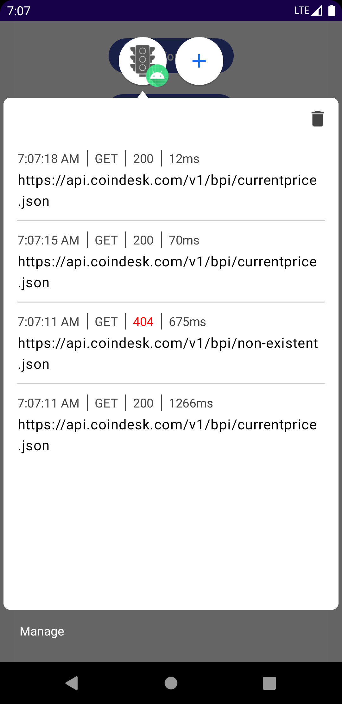
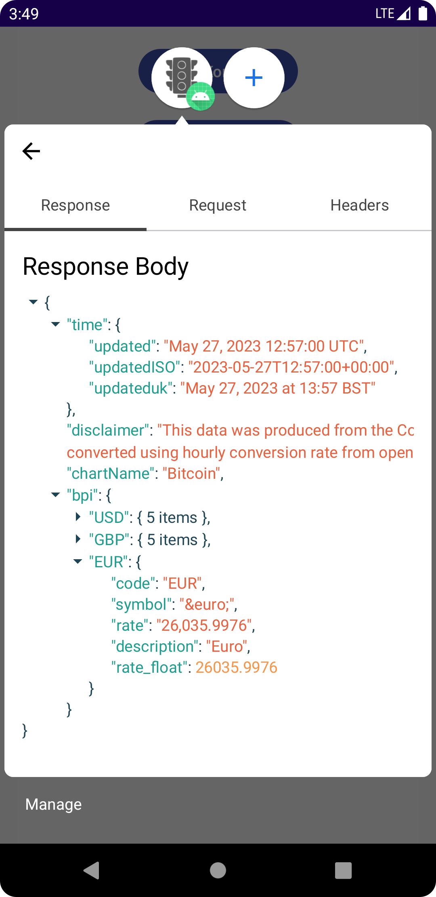
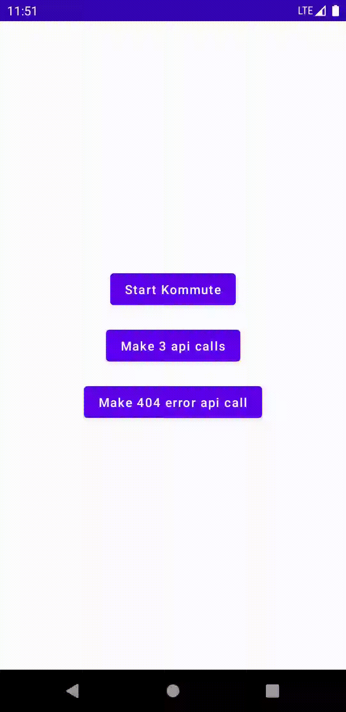

#  Kommute 

   
<br /><br />
Kommute is an Android library to observe your apps network traffic while debugging.
<br /><br />

<p float="left">



</p>

## About

Kommute lets you observe the network traffic of your app for debugging purposes. It shows all connections from your OkHttp calls and displays various information like headers, request and response bodies.

Kommute uses Androids Bubble Api to show the network traffic in a hovering bubble, which makes it easily accessible while navigating through your app.
The network traffic can be observed as long as the app lives, even while it is in the background.

## Download

Kommute is a debug tool. It comes with a `no-op` version, which should be used in release builds. See `maven-central` tag at the top for latest version.

```groovy
dependencies {
    debugImplementation 'com.sebastianneubauer:kommute:latest-version'
    releaseImplementation 'com.sebastianneubauer:kommute-no-op:latest-version'
}
```

## How to use

Add Kommutes Interceptor to your OkHttp instance.

```kotlin
val kommuteInterceptor = Kommute.getInstance().getInterceptor()

val httpClient = OkHttpClient.Builder()
        .addInterceptor(kommuteInterceptor)
        .build()
```

Get the Kommute instance and call `start` to show its notification. For example in your apps `onCreate` method.
Make sure your app has notifications enabled on Android 13+.

```kotlin
Kommute.getInstance().start(context)
```

Click the expand icon on the notification to open Kommutes Bubble.

## Images and Gifs

Like regular API calls, Kommute can show calls to image and gif links and display the returned image/gif. To enable this behaviour, your image loading library needs to use the same OkHttpClient you use for networking. The following example shows the setup with [Coil](https://coil-kt.github.io/coil/).

Get your pre-built OkHttpClient, which has Kommutes Interceptor applied and remove its cache. Then add it to your ImageLoader. See [DiskCache](https://coil-kt.github.io/coil/upgrading/#disk-cache) and [Custom OkHttpClient](https://coil-kt.github.io/coil/recipes/#using-a-custom-okhttpclient) for more info.

```kotlin
val okHttpClient = getOkHttpClient().newBuilder().cache(null).build()

ImageLoader.Builder(context)
        .okHttpClient(okHttpClient) //add your OkHttpClient
        .components {               //add support for gifs
            if (SDK_INT >= 28) {
                add(ImageDecoderDecoder.Factory())
            } else {
                add(GifDecoder.Factory())
            }
        }
        .build()
```

After providing the Imageloader through the [ImageLoadingFactory](https://coil-kt.github.io/coil/getting_started/#image-loaders), it is ready to use with Coils ImageRequest or AsyncImage.

Note: If your ImageLoader uses a cache, subsequent requests to the same image might not be shown in Kommute.

## Tech Stack

- MVVM Architecture
- Coroutines/Flow
- Compose UI
- Compose Navigation
- Android Bubble Api
- Manual DI
- OkHttp Interceptor
- Turbine (Unit tests)
- Detekt (Linting)
- API validation
- GitHub Actions
- Gradle version catalog
- [JsonTree](https://github.com/snappdevelopment/JsonTree)

## Attribution

<a href="https://www.flaticon.com/free-icons/ui" title="icon">Icon created by Afian Rochmah Afif - Flaticon</a>

## License

```
Kommute
Copyright © 2023 SNAD

Licensed under the Apache License, Version 2.0 (the "License");
you may not use this file except in compliance with the License.
You may obtain a copy of the License at

http://www.apache.org/licenses/LICENSE-2.0

Unless required by applicable law or agreed to in writing, software
distributed under the License is distributed on an "AS IS" BASIS,
WITHOUT WARRANTIES OR CONDITIONS OF ANY KIND, either express or implied.
See the License for the specific language governing permissions and 
limitations under the License.
```
See [LICENSE](LICENSE.md) to read the full text.
